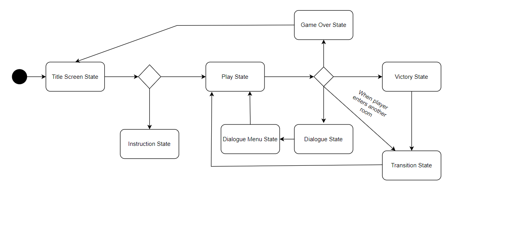
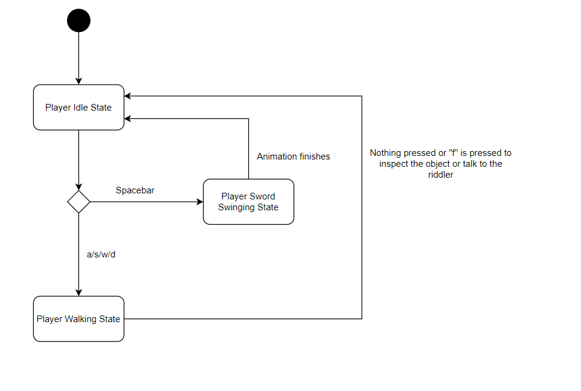
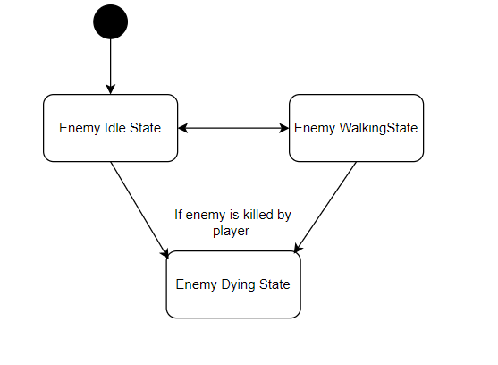
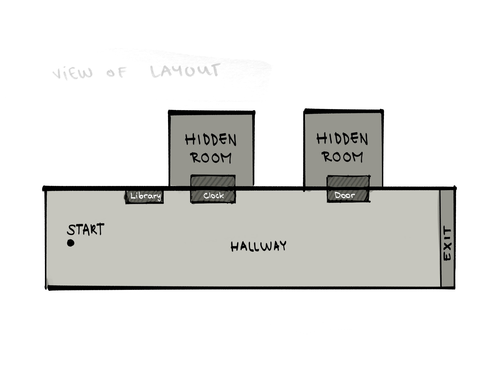
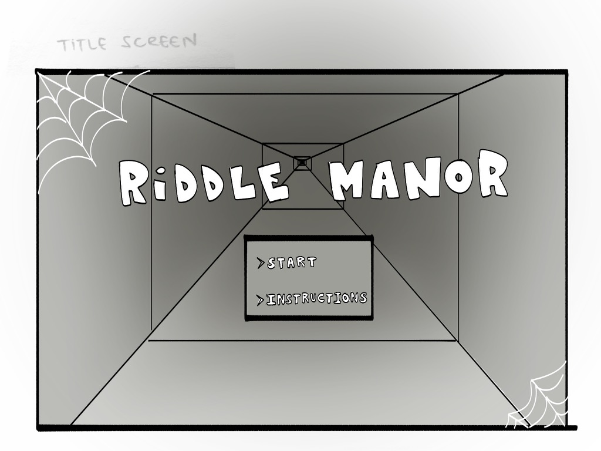
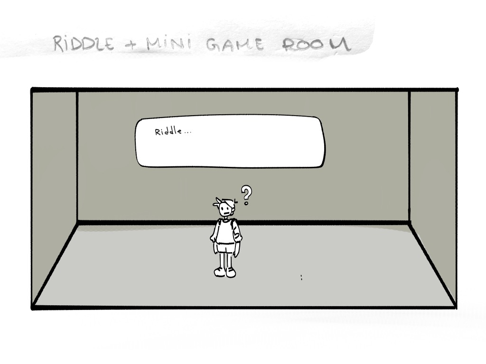
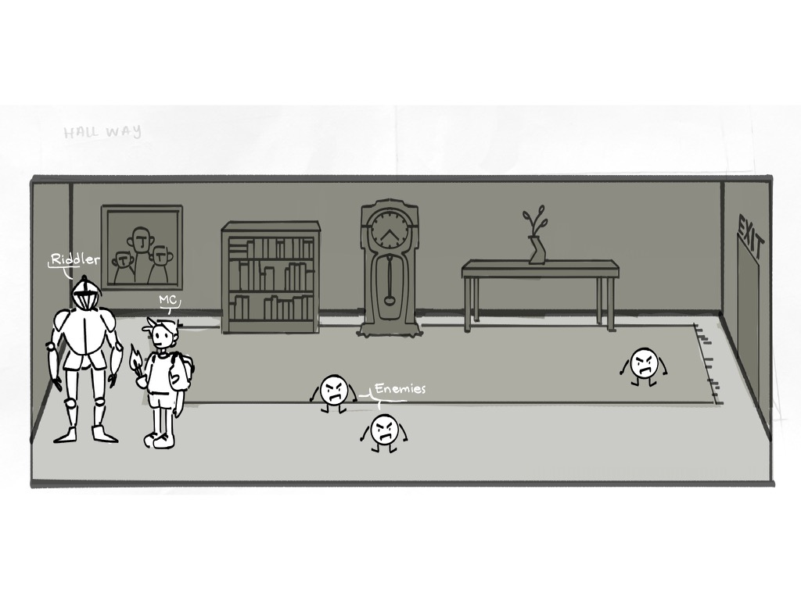

# Game Programming Project - Riddle Manor

## ✒️ Description

In this game, players assume the role of an adventurer who got lost in a dungeon while searching for treasure. A riddler suddenly appeared before them and offered to guide them. However, it is not without a challenge. Players must decipher enigmatic clues and overcome challenges to unveil the key that unlocks the looming door to freedom. If they fail to answer the riddles, they may lose the chance to escape and could be forever trapped in the dungeon. They also have to be wary of the enemies lurking around if they want to successfully escape. If the player manages to accomplish all that, they will move to the next stage and be one step closer to exiting the dungeon.

## 🕹️ Gameplay

In terms of controls, players can navigate using A/S/W/D keys. To inspect an object, press 'i', and a text box will appear on the screen, providing a description of the object and its contents. If players wish to engage in conversation with the riddler, they can also press 'i' to interact with him. Additionally, players can swing their sword by pressing the spacebar. 

In each level, the player must find the key to unlock the door and progress to the next stage. They explore the surroundings, using riddles as hints. For example, the riddler might ask, 'What has two hands on its face but no arms?' Once the player finds the answer, like 'clock,' they search around it to discover a hidden room.

In the rooms, there is a chance of encountering enemies, so players must be careful not to lose a heart and should use their sword to defeat them. Inside the hidden room, players may need to inspect books for the next clue, guiding them to another secret passage. Here, a new challenge awaits, such as deciphering an ancient text, with instructions to return to the riddler once they find an answer. Players can inspect objects for hints on how to proceed.

Upon completion, players return to the riddler, who poses questions with multiple options. The correct answer corresponds to the deciphered text. Failing to provide the correct answer results in losing a heart. However, success rewards the player with the key to unlock the door and advance to the next stage. Therefore, players must ensure they carefully consider their answers.

If the player loses all their hearts at any point in the game, it's a game over, redirecting them to the title screen. In essence, each level follows a three-step process. Using the example above, the first step is finding the clock and entering the hidden room, the second involves inspecting the books to find the other secret passage, and the third is deciphering the text and providing the answer to the riddler.

We will be using the riddles in the following websites in our game as inspirations: [100 Riddles and Their Answers](https://www.dndspeak.com/2018/11/28/100-riddles-and-their-answers/) and [Brain Teasers](https://www.braingle.com/brainteasers/All.html)

## 📃 Requirements

1. In each level, the riddler talks to the player first to say the riddle. 
2. The player must be able to move around the room
3. The player must be able to interact with the riddle.
4. There is a random chance for enemies to appear.
5. The player must be able to use their sword to kill the enemies.
6. The enemies can drop off hearts at random.
7. Enemies can hurt the player. If so, they lose a heart.
8. The player must be able to inspect objects.
9. Players can gain hearts at random when inspecting objects.
10. When players inspect an object, a text box must appear describing the object and its content. If there is a heart, it will be indicated there.
11. When the player gives the wrong answer to the riddler, they lose a heart.
12. If the player loses all their heart, it’s game over. They are redirected to the title screen.
13. The player's remaining hearts and the game’s level are indicated in the top bar.
14. Players can grab objects. If they do, its icon will appear in the top bar.

### 🤖 State Diagram

Game

Player

Enemy

### 🗺️ Class Diagram

[Class Diagram](./assets//images/class_diagrams_v2.drawio.pdf)

### 🧵 Wireframes

Map Layout

Title Screen

Hidden Room

Main Room

### 🎨 Assets

#### 🖼️ Sprites
- [Room Decor](https://penzilla.itch.io/top-down-retro-interior)
- [Room Walls and Floor](https://deadmadman.itch.io/the-quaken-assets)
- [Enemies](https://0x72.itch.io/dungeontileset-ii)
- [Characters](https://sagak-art-pururu.itch.io/24pxminicharacters)

#### ✏️ Fonts

- [Roboto](https://fonts.google.com/specimen/Roboto)

#### 🔊 Sounds

- Zelda Assignment
    - sword.wav
    - hit_enemy.wav 
    - hit_player.wav
    - door.wav
- [Key found](https://freesound.org/people/MATRIXXX_/sounds/459694/) 
- [Game music background](https://freesound.org/people/Speedenza/sounds/251530/) 
### 📚 References
